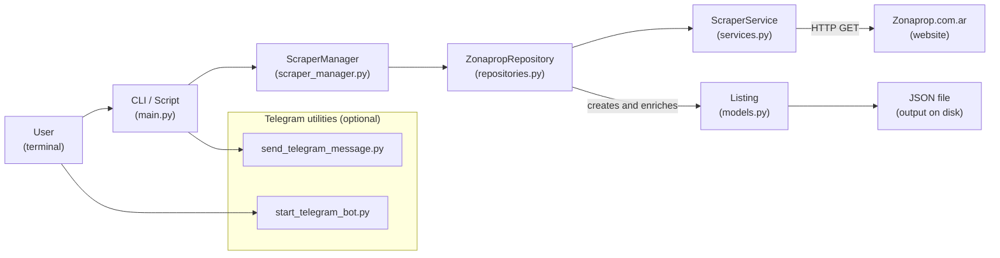

## Didactic guide to the Zonaprop Crawler project

This guide explains **how the project is structured**, **what each component does**, and **how data flows** from Zonaprop to the final JSON file. The goal is that, even if you are not familiar with the code or with web scraping, you can understand the logic and safely extend or modify it.

You can read it top‑to‑bottom like a small **introductory course**: first a high‑level overview, then each component in turn, and finally ideas on how to extend the project. You do not need to understand every technical detail on the first read; the main objective is to give you a mental map that you can come back to while working with the code.


### Project goal

Imagine that every day you want to review new Zonaprop listings for a specific neighborhood and compare prices, areas or features. Doing this manually means opening the site, changing pages, opening detail views, copying values into a spreadsheet, and so on. The **Zonaprop Crawler** project exists to **automate** that repetitive work.

Concretely, the project:

- **Opens a Zonaprop search URL** (for example, rentals in Caballito).
- **Walks through several result pages** without you having to click “next”.
- **Reads each property card**, visits its detail page and extracts richer information.
- **Stores everything in a structured JSON file**, ready for analysis, dashboards or any other downstream use.

The main goal is to **turn HTML pages into structured data** that describes real‑estate listings (`Listing`). In other words: transform “web pages” into “rows of data” that you can later filter, group, plot or load into another tool.


## High‑level data flow

Before looking at each file, it helps to have a mental picture of the “journey” that the data follows. You can think of it as a small **assembly line**: a Zonaprop URL enters on one side and a neatly formatted JSON file comes out on the other.

We can summarize the flow in 5 steps:

1. **Command‑line entry point** (`main.py`):  
   The user runs a command (`python main.py ...`), passes parameters such as `--max_pages`, `--output`, and `--url`, and this module reads them, wires up the required objects, and kicks off the scraping process.

2. **HTTP service** (`ScraperService` in `services.py`):  
   Whenever the scraper needs to fetch a Zonaprop page, it does not call `requests` directly. Instead, it uses this service, which adds **automatic retries** and **random delays** so that we do not hammer the server.

3. **Zonaprop‑specific repository** (`ZonapropRepository` in `repositories.py`):  
   This component understands Zonaprop’s HTML “language”. It knows **how to navigate pagination**, how to find the listing cards on each result page, and how to reach the detail page of each property to extract additional information.

4. **Scraping orchestrator** (`ScraperManager` in `scraper_manager.py`):  
   This acts as a coordinator: it asks the repository for the list of page URLs, iterates through them and accumulates all the `Listing` objects that are discovered.

5. **Writing to disk** (back in `main.py`):  
   Once the “factory” has finished its job, `main.py` takes the `Listing` objects, converts them to dictionaries (`to_dict()`), and finally writes the full list to a JSON file.

In parallel, there are **Telegram helper scripts** (`send_telegram_message.py` and `start_telegram_bot.py`) that can be used to send notifications or discover chat/user IDs, but they are not part of the core scraping flow.


### Component architecture diagram

The following diagram summarizes how the modules relate to each other. It does not capture all internal details, but it helps visualize who calls whom and how data moves through the system:



You can read it like this: the user runs `main.py`, which delegates to `ScraperManager`. That in turn calls `ZonapropRepository`, which uses `ScraperService` to fetch pages from Zonaprop and gradually builds `Listing` objects. In the end, `main.py` takes those `Listing` instances and turns them into a JSON file.


## Main components

### 1. Domain model: `Listing` (`models.py`)

If you think of the project as a small application centered around “real‑estate business logic”, the heart of it is the **properties** being scraped. In the code, each property is represented by an instance of the `Listing` class.

#### What it represents

- `Listing` is a **dataclass** that models a single Zonaprop property listing.
- It does not represent raw HTML, but rather **the conceptual idea of a property**: price, location, number of rooms, areas, publisher information, and so on. It is the “clean” shape we want to extract from the HTML.

#### Key fields (conceptual view)

Instead of juggling loose strings, `Listing` groups the information about each property into named attributes:

- **Identification and metadata**:
  - `id`: identifier extracted from the listing URL (the trailing numbers).
  - `date`: the date when the scraping was performed (not the publishing date on Zonaprop).
- **Price and currency**:
  - `price`: numeric amount as a cleaned string (no symbols).
  - `currency`: e.g. `USD` or `ARS`.
  - `expenses`: building expenses, if present.
- **Location and description**:
  - `location_address`: address or reference.
  - `location_area`: neighborhood/area shown on the card.
  - `features`: list of short feature texts (rooms, square meters, etc.).
  - `description`: short summary shown on the card.
  - `url`: link to the listing detail page.
- **More detailed attributes (filled from the detail page)**:
  - `total_area`, `covered_area`, `rooms`, `bathrooms`, `parking_spaces`, `bedrooms`, `age`.
  - Publisher data: `publisher_name`, `publisher_id`, `publisher_url`.

#### Key behavior

In addition to holding data, `Listing` also knows how to **update itself** and **prepare for JSON serialization**:

- **`update_details(self, details: dict)`**:
  - Receives a dictionary whose keys match attributes on `Listing`.
  - Only updates attributes that already exist on the class.
  - Ignores unknown keys (to avoid breaking when HTML changes introduce extra fields).

- **`to_dict(self)`**:
  - Converts the object into a **JSON‑ready dictionary**:
    - Skips private attributes and `None` values.
    - Converts `date` to an ISO‑formatted string (for example `2026-02-17`).

The general pattern is: when scraping a results page, the code first builds a `Listing` with basic card data; then, after visiting the detail page, it computes a dictionary with extra information and “injects” it into the same instance via `update_details()`.


### 2. HTTP service and rate limiting: `ScraperService` (`services.py`)

Any scraper lives in two worlds: **networking** (making requests, handling errors, waiting between calls) and **parsing** (understanding HTML and turning it into data). `ScraperService` encapsulates the networking part so that the rest of the code does not need to worry about `requests` details or retry logic.

#### Main responsibility

- Act as a **thin network layer** that:
  - Creates an HTTP session with **automatic retries**.
  - Applies a **random delay** before each request so we do not behave like an impatient robot.

#### Key points

- It creates a `requests.Session` configured with:
  - Up to 5 retries on 500, 502, 503 and 504 errors.
  - A `backoff_factor` that spaces out retries.
- Main method: **`rate_limited_request(url, headers)`**:
  - Sleeps for 3–7 random seconds.
  - Performs a `GET` with the given headers (including a `User-Agent`).
  - On success:
    - Returns the `Response`.
  - On network or HTTP errors:
    - Logs the error and returns `None`.

Conceptually, this service answers the question **“how do we request pages?”** in a reasonably polite way, while the rest of the code focuses on **“what do we do with those pages?”**. If in the future you want to change retry policy, timeouts, or headers, this is the place to do it.


### 3. Repository abstraction and Zonaprop repository (`repositories.py`)

While `ScraperService` knows how to fetch pages, some component must decide **which pieces of HTML to look at** and **which bits of text to extract**. That is the role of the **listing repository**.

#### 3.1. `ListingRepository` interface

The abstract `ListingRepository` class defines the “to‑do list” that any concrete implementation (for any portal) must handle:

- `get_all_page_urls(start_url, max_pages)`: get the URLs of all result pages to visit.
- `scrape_page(url)`: read and process a single result page (many listing cards).
- `scrape_listing_details(url)`: read and process a single detail page (one property).

The idea is to separate the **generic scraping workflow** from the **portal‑specific details**. This lets you implement another repository for a different real‑estate site without changing the rest of the pipeline.

#### 3.2. Concrete implementation: `ZonapropRepository`

`ZonapropRepository` is a `ListingRepository` implementation **specialized for Zonaprop**: it understands the site’s HTML and URL patterns and knows how to translate them into `Listing` instances.

##### `get_all_page_urls(start_url, max_pages)`

1. Start with a list of URLs containing only `start_url`.
2. Use `ScraperService` to request that page.
3. With `BeautifulSoup`, look for:
   - The current page number in the HTML (`PAGING_X`).
   - The link to the **next page** using a selector with `data-qa`.
4. If a next‑page link is found:
   - Build the full URL.
   - Append it to the list.
   - Move to that URL and repeat the process.
5. Stop when:
   - There is no next‑page link, or
   - The `max_pages` limit (if provided) has been reached.

Conceptually, this step is just **“follow the next‑page button”** until you either run out of pages or you hit the configured limit.

##### `scrape_page(url)`

1. Request the result page using `ScraperService`.
2. Use `BeautifulSoup` to find **all listing cards** on that page.
3. For each card:
   - Extract the **detail URL** of the property.
   - Extract the information visible on the card:
     - Price, currency, expenses.
     - Address and area.
     - Feature list (rooms, square meters, etc.).
     - Short description.
   - Create a `Listing` object with that base information.
   - Call `scrape_listing_details(detail_url)` to fill in the remaining fields.
   - Merge the new data into the object via `Listing.update_details()`.
4. Return the list of fully populated `Listing` objects for that page.

This clearly shows the separation of responsibilities:

- This method **knows which CSS selectors to use** to extract data.
- It does not worry about how requests are made (that’s `ScraperService`).
- It does not worry about how the final data is serialized (that happens later).

##### `scrape_listing_details(url)`

1. Request the **detail page** for a single property.
2. Build a `BeautifulSoup` object from the returned HTML.
3. Call two internal helpers:
   - `_extract_feature_information(soup)`:
     - Looks for the feature section with icons that represent:
       - Total area (`total_area`), covered area (`covered_area`).
       - Rooms, bathrooms, parking spaces, bedrooms.
       - Age (`age`).
     - Maps icon CSS classes to attribute names on `Listing`.
   - `_extract_publisher_information(soup)`:
     - Iterates over inline `<script>` tags.
     - Looks for a JSON‑like fragment containing publisher data.
     - Parses it and extracts name, ID and URL of the publisher.
4. Return a dictionary with these extra fields.
5. That dictionary is then used to update the previously created `Listing`.

##### Utilities used here (`utils.py`)

- **`safe_extract(element, selector, attribute=None)`**:
  - Tries to find a child element using a CSS selector.
  - Returns `None` instead of raising if nothing is found.
  - If `attribute` is provided, returns that attribute’s value; otherwise, returns the element text.

- **Text‑cleaning helpers**:
  - `clean_price_string`, `clean_expenses_string`, `clean_area_string`:
    - Strip symbols (`$`, `USD`, dots, text suffixes, etc.).
    - Leave values in a more usable, uniform format.
  - `get_currency_type`:
    - Infers whether the price is in `USD` or `ARS` based on the original string.

At this layer, the main goal is to **translate messy HTML/text into clean domain values** so that the rest of the code does not need to worry about formatting quirks.


### 4. Scraping orchestrator: `ScraperManager` (`scraper_manager.py`)

**Main responsibility**

- Coordinate the scraping flow **end‑to‑end**, without dealing with HTML details.

**What `scrape(start_url, max_pages)` does**

1. Ask the repository (`ListingRepository`) for all page URLs:
   - `page_urls = repository.get_all_page_urls(start_url, max_pages)`
2. Initialize an empty `Listing` list.
3. For each `page_url` in `page_urls`:
   - Call `repository.scrape_page(page_url)` to get the listings on that page.
   - Extend the global list with those results.
4. Return the complete list of `Listing` objects from all pages.

In other words, it is a **high‑level loop** that:

- First **discovers which pages exist**.
- Then **walks each page and aggregates everything**.


### 5. CLI entry point: `main.py`

**Main role**

- This is the file you run with `python main.py`.
- It is responsible for:
  - Reading command‑line parameters.
  - Creating the right instances (`ScraperService`, `ZonapropRepository`, `ScraperManager`).
  - Starting the scraping process.
  - Persisting results to JSON.

**Conceptual flow**

1. Configure logging (so you can see info and warning messages).
2. Define and parse arguments:
   - `--max_pages`
   - `--output`
   - `--url`
3. Instantiate:
   - `scraper_service = ScraperService()`
   - `repository = ZonapropRepository(scraper_service)`
   - `manager = ScraperManager(repository)`
4. Call:

   ```python
   listings = manager.scrape(args.url, max_pages=args.max_pages)
   ```

5. If there are results:
   - Open the file indicated by `--output`.
   - Call `listing.to_dict()` for each item.
   - Dump the list as pretty‑printed JSON.
6. Log how many listings were saved and exit.

In short, `main.py` is **the glue** that ties everything together and exposes a simple “run one command, get one JSON file” experience.


### 6. Telegram helper scripts

These scripts are not part of the core scraping flow, but they **complement the project** by allowing you to send notifications or experiment with Telegram integration.

#### `send_telegram_message.py`

- Loads `BOT_TOKEN` and `CHAT_ID` from environment variables (for example via `.env`).
- Defines:

  ```python
  send_telegram_message(bot_token, chat_id, message)
  ```

  which sends a plain‑text message to a Telegram chat using the Bot API.

- You can use it:
  - **As a script** (running the file directly).
  - **As a library** by importing the function from another module.

#### `start_telegram_bot.py`

- Defines a `TelegramMessenger` class using `python-telegram-bot`.
- When you run it:
  - It starts a bot that answers any message with:
    - The **chat ID**.
    - The **user ID**.
- This is useful to:
  - Quickly discover which `CHAT_ID` to use in other scripts.
  - Verify that your bot is correctly configured.


## Journey of a listing: from Zonaprop to JSON

To recap, here is the lifecycle of **a single listing**:

1. **Result page**:
   - `ZonapropRepository.scrape_page` receives a result‑page URL.
   - It finds the card corresponding to the listing.
   - It extracts:
     - Price, currency, expenses.
     - Location, features, description.
     - Detail URL.
   - It creates a `Listing` with that base information.

2. **Detail page**:
   - `scrape_listing_details` visits the detail URL.
   - It extracts additional information:
     - Areas, rooms, bathrooms, etc.
     - Publisher data (name, ID, URL).
   - It returns a dictionary with that data.

3. **Model enrichment**:
   - The initial `Listing` calls `update_details(details)`.
   - Internal fields on the object are added or updated.

4. **Accumulation**:
   - That `Listing` is added to the list for the current page.
   - Those page‑level results are appended to the global list in `ScraperManager`.

5. **JSON serialization**:
   - `main.py` converts each `Listing` to a dict via `to_dict()`.
   - The whole list is saved as a human‑readable JSON file.


## How to extend or modify the logic

This section is especially important if you plan to **change or extend the project**.

### Change what is scraped (area, operation, property type)

- What gets scraped is determined **entirely by the initial URL** (`--url` in `main.py`).
- If that URL represents:
  - A different neighborhood, or
  - Sales instead of rentals, or
  - Houses instead of apartments,
  
  the scraper will still work **as long as the underlying HTML structure is the same**.

Steps:

1. Go to Zonaprop and build the search you care about.
2. Copy the URL from your browser.
3. Run:

   ```bash
   python main.py --url "PASTE_URL_HERE" --max_pages 3 --output results.json
   ```


### Add a new field to the `Listing` model

Suppose you now want to track whether each property has a balcony.

1. **Add the attribute to `Listing`** (`models.py`):
   - Introduce a new optional property, for example:
     - `has_balcony: Optional[bool] = None`
2. **Extract the value from HTML**:
   - In `ZonapropRepository.scrape_page` or in `scrape_listing_details`, find the HTML element that indicates the balcony.
   - Translate it to a value (`True`/`False`, or similar) and put it into the `details` dictionary passed to `update_details()`.
3. **Let `update_details()` do its job**:
   - Because the attribute already exists on `Listing`, it will be updated correctly.
4. **Done**:
   - `to_dict()` will automatically include the new field (as long as it is not `None`).


### Adjust pagination logic

If Zonaprop changes how its pagination works:

- Most changes will likely be confined to:
  - `ZonapropRepository.get_all_page_urls`.

Suggested approach:

1. Save HTML snapshots of a few pages (there are already examples in the `example/` folder).
2. Update the selectors or regexes that detect the current page number and the next‑page link.
3. Test with a small number of pages (`--max_pages 2`) and watch the logs.


### Adapt the code to another real‑estate portal

If you want to scrape a different site:

1. Create a new class, for example `OtherPortalRepository`, that **inherits from** `ListingRepository`.
2. Implement:
   - `get_all_page_urls()` for that portal.
   - `scrape_page()` with HTML selectors specific to the new site.
   - `scrape_listing_details()` for the portal’s detail pages.
3. In `main.py`, instantiate your new repository instead of `ZonapropRepository`.

The advantage of having the `ListingRepository` interface is that you **do not have to touch the rest of the code**: `ScraperManager` will continue to work as‑is.


## Conceptual summary

- **`Listing`**: clean representation of a property (business data, not HTML).
- **`ScraperService`**: how HTTP requests are made (with delays and retries).
- **`ZonapropRepository`**: how Zonaprop’s specific HTML is interpreted.
- **`ScraperManager`**: how multiple pages are traversed and results are aggregated.
- **`main.py`**: how everything is exposed as a simple script that outputs JSON.
- **Telegram scripts**: optional utilities for notifications and chat‑ID discovery.

If you keep this division of responsibilities in mind, it becomes much easier to:

- Debug issues when scraping fails.
- Update selectors when the HTML changes.
- Extend the model with new fields.
- Reuse parts of this code in other scraping projects.

